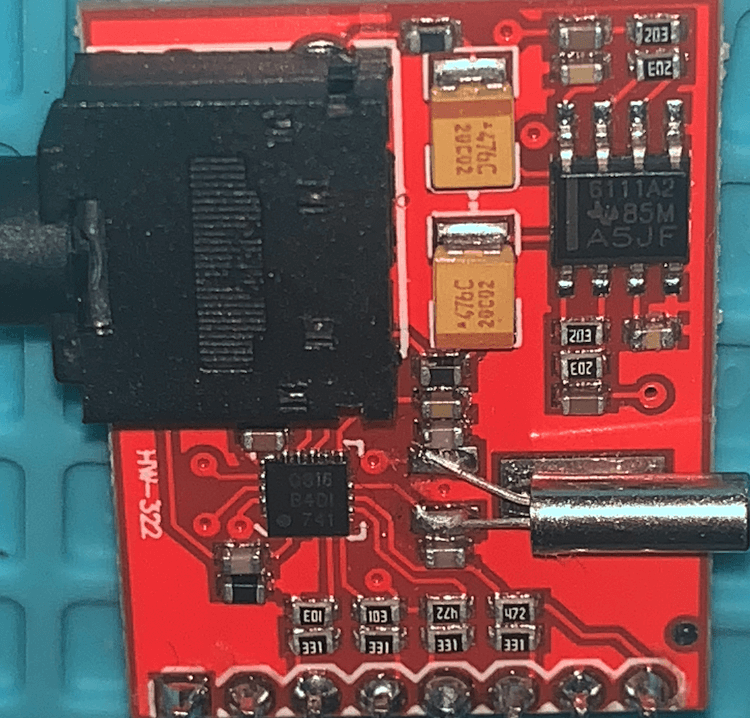
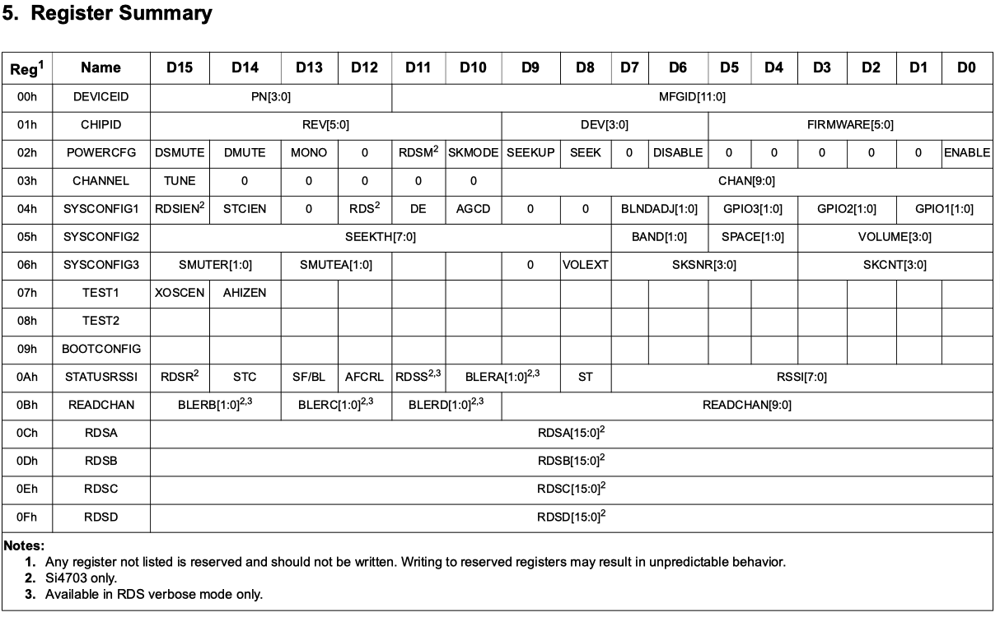

# SI470X Arduino Library

It is an Arduini Library for Si4702/03 FM tuner family. 

## Contents

1. [Preface](https://pu2clr.github.io/SI470X#preface)
2. [API Documentation](https://pu2clr.github.io/SI470X/extras/apidoc/html)
3. [MIT License](https://pu2clr.github.io/SI470X#mit-License)
4. [Si470X Library features](https://pu2clr.github.io/SI470X#si4703-library-features)
5. [SI470X and Registers](https://pu2clr.github.io/SI470X#si470x-and-registers)
6. [SCHEMATIC](https://pu2clr.github.io/SI470X#schematic)
7. [Examples](https://github.com/pu2clr/SI470X/tree/master/examples)
8. [References](https://github.com/pu2clr/SI470X#references)

## Preface

This project is about an Arduino library for the SI470X device. __The communication protocol used by this library is the I²C__. This library can be freely distributed using the MIT Free Software model. 
The SI470X is a FM DSP receiver from Silicon Labs with RDS/RBDS support. This document is aimed at the Arduino developers, radio experimenters, hobbyists and anyone interested in building a receiver based on the Si470X and will show you Arduino source codes, schematics, examples and tips to help you to build a receiver based on Arduino board and the SI470X devices. 



I think the best way to start a project based on this device is to acquire a breakout board like the one shown in the following figure. 

The board above or similar can be found on [Sparkfun](https://www.sparkfun.com/products/12938), [eBay](https://www.ebay.com/) and [Aliexpress](https://pt.aliexpress.com/af/SI4703.html?d=y&origin=n&SearchText=SI4703&catId=0&initiative_id=SB_20200626043355).  Also, there is the [Si4703 Evaluation Kit](https://www.silabs.com/products/development-tools/audio-and-radio/si4703-evaluation-kit) from Silicon Labs. 

### See also

1. [PU2CLR Si4735 Library for Arduino](https://pu2clr.github.io/SI4735/). This library was built based on “Si47XX PROGRAMMING GUIDE; AN332” and it has support to FM, AM and SSB modes (LW, MW and SW). It also can be used on all members of the SI47XX family respecting, of course, the features available for each IC version; 
2. [PU2CLR SI4844 Arduino Library](https://github.com/pu2clr/SI4844). This is an Arduino library for the SI4844, BROADCAST ANALOG TUNING DIGITAL DISPLAY AM/FM/SW RADIO RECEIVER,  IC from Silicon Labs.  It is available on Arduino IDE. This library is intended to provide an easier interface for controlling the SI4844.
3. [PU2CLR AKC695X Arduino Library](https://pu2clr.github.io/AKC695X/). The AKC695X is a family of IC DSP receiver from AKC technology. The AKC6955 and AKC6959sx support AM and FM modes. On AM mode the AKC6955 and AKC6959sx work on LW, MW and SW. On FM mode they work from 64MHz to 222MHz.
4. [PU2CLR KT0915 Arduino Library](https://pu2clr.github.io/KT0915/).

## MIT License 

Copyright (c) 2019 Ricardo Lima Caratti

Permission is hereby granted, free of charge, to any person obtaining a copy of this software and associated documentation files (the "Software"), to deal in the Software without restriction, including without limitation the rights to use, copy, modify, merge, publish, distribute, sublicense, and/or sell copies of the Software, and to permit persons to whom the Software is furnished to do so, subject to the following conditions:

The above copyright notice and this permission notice shall be included in all copies or substantial portions of the Software.

THE SOFTWARE IS PROVIDED "AS IS", WITHOUT WARRANTY OF ANY KIND, EXPRESS OR IMPLIED, INCLUDING BUT NOT LIMITED TO THE ARRANTIES OF MERCHANTABILITY, FITNESS FOR A PARTICULAR PURPOSE AND NONINFRINGEMENT. IN NO EVENT SHALL THE AUTHORS OR COPYRIGHT HOLDERS BE LIABLE FOR ANY CLAIM, DAMAGES OR OTHER LIABILITY, WHETHER IN AN ACTION OF CONTRACT, TORT OR OTHERWISE, ARISING FROM, OUT OF OR IN CONNECTION WITH THE SOFTWARE OR THE USE OR OTHER DEALINGS IN THE SOFTWARE.

 

## Si470X Library features

This library uses the I²C communication protocol and implements most of the functions offered by Si470X (SI4701/02/03) IC family from Silicon Labs. This library also has primitive functions that make it easier for you to implement commands that may not have been implemented yet. See [setAllRegisters, getAllRegisters, getStatus](https://pu2clr.github.io/SI470X/extras/apidoc/html/) functions. It is worth noting, however, that this library is constantly improving. Check the API documentation before implementing a new function. It is likely that your demand is already implemented. __The main features of this library are listed below__.

1. Open Source. It is free. You can use, copy, modify, merge, publish, distribute, sublicense, and/or sell copies of the Software. See [MIT License](https://pu2clr.github.io/SI470X/#mit-license) to know more.  
2. Built based on [Broadcast FM Radio Tuner for Portable Applications - Si4702/03-C19](https://www.silabs.com/documents/public/data-shorts/Si4702-03-C19-short.pdf) and [Si4702/03-C19 - BROADCAST FM RADIO TUNERFOR PORTABLE APPLICATIONS](https://www.silabs.com/documents/public/data-sheets/Si4702-03-C19.pdf);
3. C++ Language and Object-oriented programming. You can easily extend the SI470X class by adding more functionalities;
4. __Available on Arduino IDE (via Manage Libraries)__. Easy to install and use;
5. Seek tuning;
6. Automatic frequency control (AFC);
7. Automatic gain control (AGC);
8. Programmable FM Band ranges;
9. Programmable SPACE Settings; 
10. Programmable de-emphasis (50/75 μs);
11. Stereo / Mono control;
12. Real time rssi report; 
13. Volume control (including mute audio);
14. RDS/RBDS Processor;
15. [Well-documented API](https://pu2clr.github.io/SI470X/extras/apidoc/html/).

## SI470X and Registers

The SI4701/02/03 can be controlled by deal with register via I2C interface.  The tebla below was extracted from Silicon Labs; document Si4702/03-C19 - "BROADCAST FM RADIO TUNER FOR PORTABLE APPLICATIONS"; Rev 1.1; page 22. This table shows the set of register that you can used to controle the device.

Source: Silicon Labs; document Si4702/03-C19 - "BROADCAST FM RADIO TUNER FOR PORTABLE APPLICATIONS"; Rev 1.1; Page 22.

__Except that you need something very specific, the PU2CLR SI470X Arduino Library offers all the functions necessary for you to build your own FM receiver using an Arduino Board__.  If you need something else, this library implemented some basic functions to deal direct with the device registers shown above. See __getShadownRegister__, __setShadownRegister__, __setAllRegisters, getAllRegisters__ and __getStatus__ functions on [https://pu2clr.github.io/SI470X/extras/apidoc/html/](https://pu2clr.github.io/SI470X/extras/apidoc/html/).

## Schematic

As previously reported, in general, the SI4703 device is already sold in kit or breakout board format. So, the circuit below can help you to connect the arduino to the shield. In this case, you will not need the crystal, pull up resistors, capacitors and audio jack output. Also, the labels will guide you.  The table bellow shows the connections. 

### Wire up on Arduino UNO, Pro mini or other based on ATmega 328.

| SI4703 / Description      |  Arduino Pin  |
| --------------------      | ------------  |
| RESET (pin 5)             |     14 / A0   |
| SDIO (pin  8)             |     A4        |
| SCLK (pin  7)             |     A5        |

See the schematic with __TFT display, Encoder and push buttons__ [here](./examples)

### Voltage operation

* __The SI470X device is a 3.3V part. If you are not using a 3.3V version of Arduino, you have to use a kind of 5V to 3.3V bidirectional converter. It is important to say that just power the Si470X device with 3.3V from Arduino board is not enough. You have to be aware that the Arduino that operates with 5V, the digital pins and the I2C bus will send 5V signals to the Si470X device. That configuration can make the system unstable or damage the Si47XX device. If you are using a breakout board based on SI470X, check its operating voltage before connecting it to you 5V Arduino Board.__   

# References

* [AN230 - Si4700/01/02/03 PROGRAMMING GUIDE](https://www.silabs.com/documents/public/application-notes/AN230.pdf)
* [Si4702/03-C19 - BROADCAST FM RADIO TUNERFOR PORTABLE APPLICATIONS](https://www.silabs.com/documents/public/data-sheets/Si4702-03-C19.pdf)

