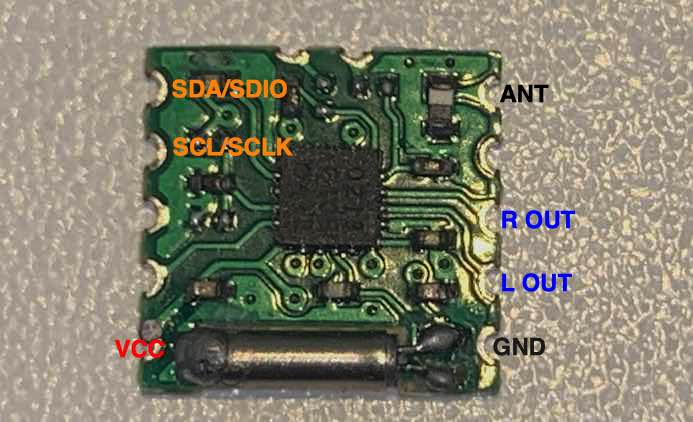
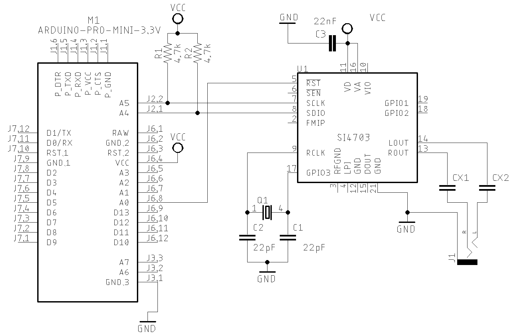

# [SI470X Arduino Library](https://pu2clr.github.io/SI470X/)

It is an Arduino Library for Si4701/02/03 FM tuner. This [Silicon Labs](https://www.silabs.com/audio-and-radio/fm-radios/si4702-03-radio-receivers/device.si4703#techdocs) device family integrates the complete functionalities for FM  receivers, including RDS (Si4703). You can compile and run this library on most of board available on Arduino IDE (Examples: ATtiny85, boards based on ATmega328 and ATmega-32u4, ATmega2560, ARM Cortex, STM32, Arduino DUE, ESP32 and more).

This library can be freely distributed using the MIT Free Software model. 

[Copyright (c) 2019 Ricardo Lima Caratti](https://pu2clr.github.io/SI4735/#mit-license). 

Contact: __pu2clr@gmail.com__.

## Donate 

[If you find this project useful, consider making a donation so that the author of this library can purchase components and modules for improvements and testing of this library. Click here to donate.](https://www.paypal.com/donate/?business=LLV4PHKTXC4JW&no_recurring=0&item_name=Consider+making+a+donation.++So+I+can+purchase+components+and+modules+for+improvements+and+testing+of+this+library.&currency_code=USD)

## Contents

1. [Preface](https://pu2clr.github.io/SI470X#preface)
2. [API Documentation](https://pu2clr.github.io/SI470X/extras/apidoc/html)
3. [MIT License](https://pu2clr.github.io/SI470X#mit-License)
4. [Thanks](https://pu2clr.github.io/SI470X#thanks)
5. [Si470X Library features](https://pu2clr.github.io/SI470X#si4703-library-features)
6. [Installation](https://pu2clr.github.io/SI470X#library-installation)
7. [SI470X and Registers](https://pu2clr.github.io/SI470X#si470x-and-registers)
8. [SCHEMATIC](https://pu2clr.github.io/SI470X#schematic)
9. [Source code - Arduino examples](https://github.com/pu2clr/SI470X/tree/master/examples)
10. [References](https://github.com/pu2clr/SI470X#references)

## Preface

This project is about an Arduino library for the SI470X device. __The communication protocol used by this library is the I²C__. This library can be freely distributed using the MIT Free Software model. The SI4703 is a FM DSP receiver from Silicon Labs with RDS/RBDS support. This document is intended for Arduino developers, radio enthusiasts, hobbyists, and anyone interested in constructing a receiver using the Si4702 or SI4703 with the Arduino development platform.



I think the best way to start a project based on this device is to acquire a breakout board like the one shown in the following figure. 

The board above or similar can be found on [Sparkfun](https://www.sparkfun.com/products/12938), [eBay](https://www.ebay.com/) and [Aliexpress](https://pt.aliexpress.com/af/SI4703.html?d=y&origin=n&SearchText=SI4703&catId=0&initiative_id=SB_20200626043355).  Also, there is the [Si4703 Evaluation Kit](https://www.silabs.com/products/development-tools/audio-and-radio/si4703-evaluation-kit) from Silicon Labs. 

### The SI4702 

Except for the SDR/RDBS feature, the SI4702 has all the functions available in the SI4703. It is easily found in the market and can be a cheaper alternative if the RDS/RBDS function is not needed.

The photo below shows the SI4702 module.

### See also

* [PU2CLR Si4735 Library for Arduino](https://pu2clr.github.io/SI4735/). This library was built based on “Si47XX PROGRAMMING GUIDE; AN332” and it has support to FM, AM and SSB modes (LW, MW and SW). It also can be used on all members of the SI47XX family respecting, of course, the features available for each IC version;
* [PU2CLR SI4844 Arduino Library](https://pu2clr.github.io/SI4844). This is an Arduino library for the SI4844, BROADCAST ANALOG TUNING DIGITAL * DISPLAY AM/FM/SW RADIO RECEIVER,  IC from Silicon Labs.  It is available on Arduino IDE. This library is intended to provide an easier interface for controlling the SI4844.
* [PU2CLR AKC695X Arduino Library](https://pu2clr.github.io/AKC695X/). The AKC695X is a family of IC DSP receiver from AKC technology. The AKC6955 and AKC6959sx support AM and FM modes. On AM mode the AKC6955 and AKC6959sx work on LW, MW and SW. On FM mode they work from 64MHz to 222MHz.
* [PU2CLR KT0915 Arduino Library](https://pu2clr.github.io/KT0915/). The KT0915 is a full band AM (LW, MW and SW) and FM DSP receiver that can provide you a easy way to build a high quality radio with low cost.
* [PU2CLR BK108X](https://pu2clr.github.io/BK108X/). The BK1086 and BK1088 are DSP receivers from BAKEN. The BK1088 is a BROADCAST FM and AM (LW, MW and ) RECEIVER and BK1086 is a subset of the BK1088 (it does not have LW and SW acording to the Datasheet).
* [PU2CLR RDA5807 Arduino Library](https://pu2clr.github.io/RDA5807/). The RDA5807 is a FM DSP integrated circuit receiver (50 to 115MHz) with low noise amplifier support. This device requires very few external components if compared with other similar devices. It also supports RDS/RBDS functionalities, direct auto gain control (AGC) and real time adaptive noise cancellation function.
* [PU2CLR SI470X Arduino Library](https://pu2clr.github.io/SI470X/). It is a Silicon Labs device family that integrates the complete functionalities for FM receivers, including RDS (Si4703).
* [PU2CLR MCP23008](https://pu2clr.github.io/MCP23008/). It is an Arduino Library to control the MCP23008/MCP23S08 8-Bit I/O Expander. The MCP23008 device provides 8-bit, general purpose, parallel I/O expansion. It can be controlled via I2C bus applications. It is a great and inexpensive device that allow you to add more devices to be controlled by your Arduino board via I2C protocol.
* [PU2CLR - PCF8574 Arduino Library](https://pu2clr.github.io/PCF8574/). It is an Arduino Library to control the PCF8574 8-Bit I/O Expander. The PCF8574 device provides 8-bit, general purpose, parallel I/O expansion. It can be controlled via I²C bus applications. It is a great and inexpensive device that allow you to add more peripherals to be controlled by your Arduino board via I²C protocol.

### More Arduino Projects developed by author 

* [Multipurpose signal generator with SI5351](https://pu2clr.github.io/SI5351/). It is a multipurpose signal generator controlled by Arduino. This project uses the SI5351 from Silicon Labs. The Arduino sketch is configured to control the SI5351 with three channels from 32.768KHz to 160MHz and steps from 1Hz to 1MHz.
* [Shortwave Arduino Transmitter](https://pu2clr.github.io/Small-Shortwave-Transmitter/). This project is about a shortwave transmitter from 3 MHz to 30 MHz. It uses the SI5351 oscillator from Silicon Labs controlled by Arduino. Also, you can use it with a crystal oscillator. In this case, you will not need the SI5351 device and Arduino. 
* [Android and iOS Bluetooth Remote Control for PU2CLR Arduino Library DSP receivers](https://pu2clr.github.io/bluetooth_remote_control/). This project is an extension of the Arduino library projects for: [SI4735](https://pu2clr.github.io/SI4735/); [AKC6959](https://pu2clr.github.io/AKC695X/) and [KT0915](https://pu2clr.github.io/KT0915/). It is a simple example that shows a way to use your smartphone as a remote control via Bluetooth. In order to follow the steps presented here, I am assuming that you have some knowledge in development for mobile devices. Also, you will need to be familiar with the Javascript programming language. The development environment used by this project is the [Apache Cordova](https://cordova.apache.org/docs/en/latest/guide/overview/index.html). Cordova is a open-source mobile development framework that allows you to develop cross-platform applications. That means you can code once and deploy the application in many system, including iOS and Android. 
Cordova provides an easy way to develop for iOS and Android.  
* [Band Pass Filter controlled by Arduino](https://pu2clr.github.io/auto_bpf_arduino/). It is a HF band pass filter controlled by Arduino. It is designed for HF receivers. With this project, you can use a set of up to four HF bandpass filters that can be selected by Arduino. To do that you will need just two digital Arduino pins.

## MIT License 

Copyright (c) 2019 Ricardo Lima Caratti

Permission is hereby granted, free of charge, to any person obtaining a copy of this software and associated documentation files (the "Software"), to deal in the Software without restriction, including without limitation the rights to use, copy, modify, merge, publish, distribute, sublicense, and/or sell copies of the Software, and to permit persons to whom the Software is furnished to do so, subject to the following conditions:

The above copyright notice and this permission notice shall be included in all copies or substantial portions of the Software.

THE SOFTWARE IS PROVIDED "AS IS", WITHOUT WARRANTY OF ANY KIND, EXPRESS OR IMPLIED, INCLUDING BUT NOT LIMITED TO THE ARRANTIES OF MERCHANTABILITY, FITNESS FOR A PARTICULAR PURPOSE AND NONINFRINGEMENT. IN NO EVENT SHALL THE AUTHORS OR COPYRIGHT HOLDERS BE LIABLE FOR ANY CLAIM, DAMAGES OR OTHER LIABILITY, WHETHER IN AN ACTION OF CONTRACT, TORT OR OTHERWISE, ARISING FROM, OUT OF OR IN CONNECTION WITH THE SOFTWARE OR THE USE OR OTHER DEALINGS IN THE SOFTWARE.

 

## Thanks

I would like to thank __Mr. Libor Tomsik__ for correction on RDS issues. 

## Si470X Library features

This library uses the I²C communication protocol and implements most of the functions offered by Si470X (SI4701/02/03) IC family from Silicon Labs. This library also has primitive functions that make it easier for you to implement commands that may not have been implemented yet. See [setAllRegisters, getAllRegisters, getStatus](https://pu2clr.github.io/SI470X/extras/apidoc/html/) functions. It is worth noting, however, that this library is constantly improving. Check the API documentation before implementing a new function. It is likely that your demand is already implemented. __The main features of this library are listed below__.

1. Open Source. It is free. You can use, copy, modify, merge, publish, distribute, sublicense, and/or sell copies of the Software. See [MIT License](https://pu2clr.github.io/SI470X/#mit-license) to know more.  
2. Built based on [Broadcast FM Radio Tuner for Portable Applications - Si4702/03-C19](https://www.silabs.com/documents/public/data-shorts/Si4702-03-C19-short.pdf) and [Si4702/03-C19 - BROADCAST FM RADIO TUNERFOR PORTABLE APPLICATIONS](https://www.silabs.com/documents/public/data-sheets/Si4702-03-C19.pdf);
3. C++ Language and Object-oriented programming. You can easily extend the SI470X class by adding more functionalities;
4. __Available on Arduino IDE (via Manage Libraries)__. Easy to install and use;
5. Seek tuning;
6. Automatic frequency control (AFC);
7. Automatic gain control (AGC);
8. Programmable FM Band ranges;
9. Programmable SPACE Settings; 
10. Programmable de-emphasis (50/75 μs);
11. Stereo / Mono control;
12. Real time rssi report; 
13. Volume control (including mute audio);
14. RDS/RBDS Processor;
15. [Well-documented API](https://pu2clr.github.io/SI470X/extras/apidoc/html/).

## Library Installation

 The easiest method to install this library is via your Arduino IDE. All you have to do is:
 
 1. Select Tools menu;
 2. Select Manage Libraries option;
 3. In the text box (top windows), type PU2CLR or SI470X;
 4. Select the PU2CLR SI470X. 

The video below shows how you can install this library via your Arduino IDE from Manage Libraries tool.



[Watch the video](https://youtu.be/fXcrtmWNcRU)

### Installing via the repository 

With this approach, you will have the __most current version__ of the library. However, __it may not be the most stable version__. This is because the current version is always in development. [Prefer releases](https://github.com/pu2clr/SI470X/releases). Do you need some old version (release) of this library?  If yes, [check here](https://github.com/pu2clr/SI470X/releases).

First, you have to [download](https://github.com/pu2clr/SI470X/archive/master.zip) this library in zip format.  
After, unzip the SI470X-master.zip file in your Arduino Library folder. 

* On __Windows__: "My Documents\Arduino\libraries"
* On __MAC OS__: ˜/Documents/Arduino/libraries
* On __Linux__: ˜/Documents/Arduino/libraries

 

## SI470X and Registers

The SI4701/02/03 can be controlled by deal with register via I2C interface.  The tebla below was extracted from Silicon Labs; document Si4702/03-C19 - "BROADCAST FM RADIO TUNER FOR PORTABLE APPLICATIONS"; Rev 1.1; page 22. This table shows the set of register that you can used to controle the device.

Source: Silicon Labs; document Si4702/03-C19 - "BROADCAST FM RADIO TUNER FOR PORTABLE APPLICATIONS"; Rev 1.1; Page 22.

__Except that you need something very specific, the PU2CLR SI470X Arduino Library offers all the functions necessary for you to build your own FM receiver using an Arduino Board__.  If you need something else, this library implemented some basic functions to deal direct with the device registers shown above. See __getShadownRegister__, __setShadownRegister__, __setAllRegisters, getAllRegisters__ and __getStatus__ functions on [https://pu2clr.github.io/SI470X/extras/apidoc/html/](https://pu2clr.github.io/SI470X/extras/apidoc/html/).

## Schematic

As previously reported, in general, the SI4703 device is already sold in kit or breakout board format. So, the circuit below can help you to connect the arduino to the shield. In this case, you will not need the crystal, pull up resistors, capacitors and audio jack output. Also, the labels will guide you.  The table bellow shows the connections. 

### Wire up on Arduino UNO, Pro mini or other based on ATmega 328.

| SI4703 / Description      |  Arduino Pin  |
| --------------------      | ------------  |
| RESET (pin 5)             |     15 / A1   |
| SDIO (pin  8)             |     A4        |
| SCLK (pin  7)             |     A5        |

### Other schematics 

#### Arduino Pro Mini and TFT 1.8 ST7735 SCHEMATIC 

#### Attiny84, Encoder and Push Buttons Schematic

#### Attiny85 and Push Buttons Schematic

#### [See examples here](./examples)

### Voltage operation

* __The SI470X device is a 3.3V part. If you are not using a 3.3V version of Arduino, you have to use a kind of 5V to 3.3V bidirectional converter. It is important to say that just power the Si470X device with 3.3V from Arduino board is not enough. You have to be aware that the Arduino that operates with 5V, the digital pins and the I2C bus will send 5V signals to the Si470X device. That configuration can make the system unstable or damage the Si47XX device. If you are using a breakout board based on SI470X, check its operating voltage before connecting it to you 5V Arduino Board.__   

# References

* [AN230 - Si4700/01/02/03 PROGRAMMING GUIDE](https://www.silabs.com/documents/public/application-notes/AN230.pdf)
* [Si4702/03-C19 - BROADCAST FM RADIO TUNERFOR PORTABLE APPLICATIONS](https://www.silabs.com/documents/public/data-sheets/Si4702-03-C19.pdf)
* [Create and use custom fonts for Adafruit_GFX libraries](https://www.youtube.com/watch?v=L8MmTISmwZ8)
* [Font Creator Now Creates Adafruit GFX Fonts](https://blog.squix.org/2016/10/font-creator-now-creates-adafruit-gfx-fonts.html)
  

