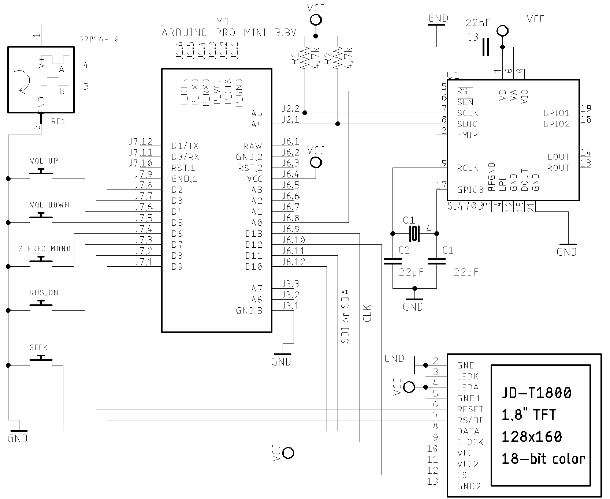

# Examples

[This folder](https://github.com/pu2clr/SI470X/tree/master/examples) has some examples that might help you to use the Si470X Arduino Library in your receiver project. If you find some error or problem during your implementation, please let me know. 

__This project is about a library to control the SI4701/02/03 devices and the focus of this project is the library and its functionalities. Please, don't ask me to assist you in your: displays, encoders, buttons or something else out the library scope. Thanks.__

The [si470x_01_serial_monitor](https://github.com/pu2clr/SI470X/tree/master/examples/si470x_01_serial_monitor) folder shows how you can check your circuit by using just the Arduino IDE Serial Monitor to control the receiver. 

Tge [si470x_02_TFT_display](https://github.com/pu2clr/SI470X/tree/master/examples/si470x_02_TFT_display) folder has an example with the traditional Display TFT based on ST7735. 

The schematic below shows the receiver example with TFT display, encoder and push buttons. 

In general, the SI4703 device is already sold in kit or shield format. So, the circuit above can help you to connect the arduino to the shield. In this case, you will not need the crystal, pull up resistors and audio jack output. Also, the labels will guide you.  The table bellow shows the connections. 

### Wire up on Arduino UNO, Pro mini or other based on ATmega 328.

| Device name               | Device Pin / Description  |  Arduino Pin  |
| ----------------          | --------------------      | ------------  |
| Display TFT               |                           |               |
|                           | RST (RESET)               |      8        |
|                           | RS  or DC                 |      9        |
|                           | CS  or SS                 |     10        |
|                           | SDI or SDA or DATA        |     11        |
|                           | CLK                       |     13        |
|     Si470X                |                           |               |
|                           | RESET (pin 5)             |     14 / A0   |
|                           | SDIO (pin  8)             |     A4        |
|                           | SCLK (pin  7)             |     A5        |
|     Buttons               |                           |               |
|                           | Volume Up                 |      4        |
|                           | Volume Down               |      5        |
|                           | Stereo/Mono               |      6        |
|                           | RDS ON/off                |      7        |
|                           | SEEK (encoder button)     |     12        |   
|    Encoder                |                           |               |
|                           | A                         |       2       |
|                           | B                         |       3       |